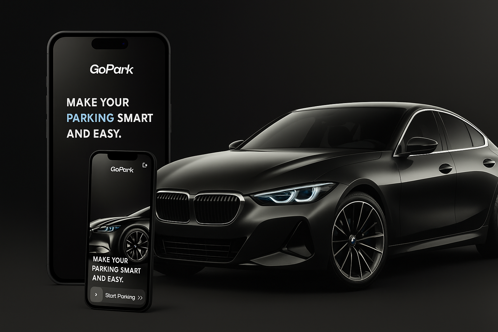
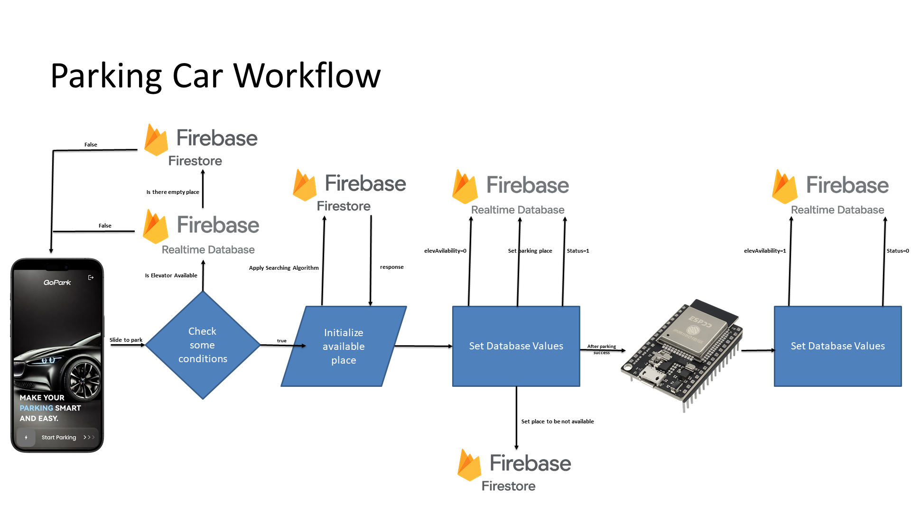
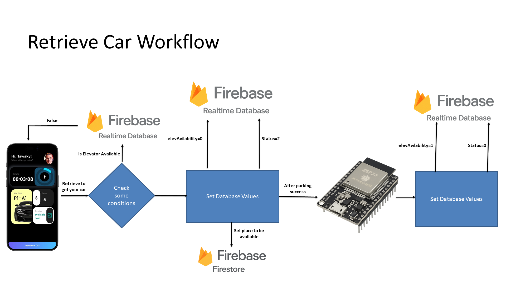

# 🚗 GoPark – Smart Parking System

 <!-- ضع صورة الكفر اللي عملناها أو أي Mockup -->

## 📌 Overview

**GoPark** is a smart parking system developed as a graduation project.  
It aims to simplify the process of **finding, reserving, and managing parking spots** through a mobile-first solution that integrates **Flutter, Firebase, and IoT hardware (ESP32)**.

The system allows users to:

- Reserve parking spots in real-time.
- Control elevators and motors inside the garage.
- Track parking duration from their profile.
- Enjoy a modern, simple, and user-friendly interface.

---

## 🛠️ Tech Stack

- **Mobile App:** Flutter (Bloc/Cubit, Syncfusion Charts)
- **Backend:** Firebase Firestore, Realtime Database, Authentication
- **Hardware:** ESP32-WROOM-32, (Motors + Sensors)
- **Other:** Google Authentication, Bluetooth/WiFi connectivity

---

## ✨ Features

- 🔑 **Secure Login** with Google Authentication.
- 📍 **Real-time Parking Availability** updates via Firebase.
- ⏳ **Parking Timer** inside user profile.
- 🛗 **Elevator Control** through the mobile app.
- 📊 **Charts & Data Visualization** with Syncfusion Flutter Charts.
- ⚡ **Smooth Integration** between mobile and IoT devices.

---

## 🔌 System Workflow

  

## 🔗 Resources

[Behance Link](https://www.behance.net/gallery/232667935/Go-Park-Smart-Parking-System)

## [Youtube Video](https://www.behance.net/gallery/232667935/Go-Park-Smart-Parking-System)
